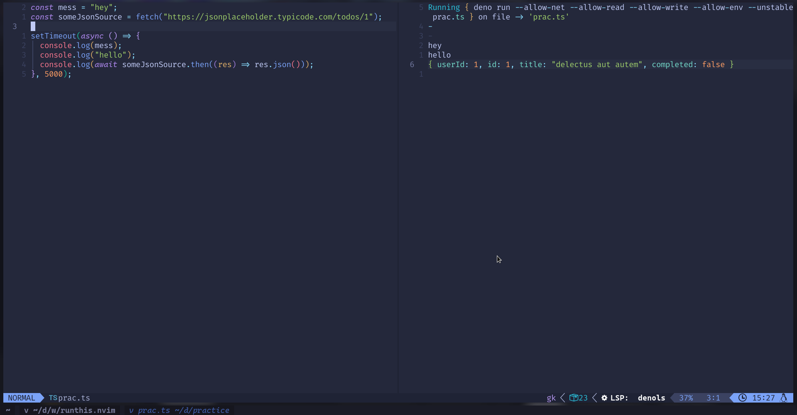

# runthis.nvim
automatically run code on save and see the output inside neovim :)

install it with your favorite plugin manager
```
use{
  "RimuhRimu/runthis.nvim",
  module = "runthis"
  } //example with packer
```

## Usage
execute in command mode
```
:RunThis or :Runthis attach //will auto run the current buf if just 1 open
```

you'll be prompted the following

```
What buffer do you choose?: ... //you'll be shown the buffers currently open
1. {buf1}
2. {buf2}
3. {buf3}
...

What command should be executed?(whole command with options): ... 
//if left empty it will use the shebang in the file
//or if it has no shebang it will try to guess how to run it
```
now when you save that buffer you'll see a split buffer with the results

you can stop executing on save with
```
:Runthis detach //you'll be asked what buffer you want to detach
```

## Config

you can change the default size of the window or the default programs to run certain
extensions if you do not provide a command or it does not have a shebang

```lua
local r = require("runthis")
r.setup({
  programs = {
    ["js"] = "deno run"
  },
  window = {
    width = 50
  }
})
```

these are the defaults

```lua
local runAbles = {
	["py"] = "python3",
	["js"] = "node",
	["lua"] = "lua",
	["hs"] = "runhaskell",
	["ts"] = "deno run --allow-net --allow-read --allow-write --allow-env --unstable",
	["go"] = "go run",
	["rb"] = "ruby",
	["rs"] = "",
	["c"] = "./main",
	["cpp"] = "./main",
	["java"] = "java",
	["sh"] = "sh",
	["fish"] = "fish",
}

local defaults = {
	runAbles = runAbles,
	winConf = {
		width = 40,
	},
}
```

# Preview

 

## NOTE

1. I have to modify the plugin to allow change the compile process
2. Obviously you cannot handle stdin using this plugin, at least not yet

## TODO

- [ ] rewrite prompt to allow autocompletion for path and commands
- [ ] track if the name of the file changes
- [ ] add a `attach/detach current` command
- [x] add configs to change the size of the plugin buffer, default runables, etc...
- [x] make possible use the plugin easily with compiled languages
